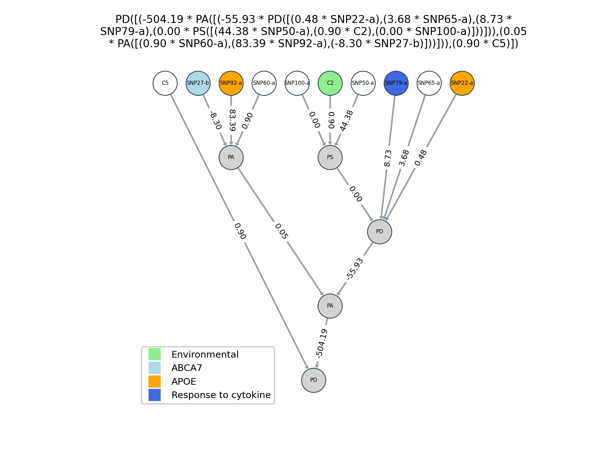

# Output Files

ATHENA produces 3 types of files during its run: summary, logs and plots. The files will have the name specified in the --out (OUT) parameter which can include a full path. Each will have an extension added to the base name as described below.

## Summary file

ATHENA writes a single summary file for each run it performs. It displays the best network for each cross-validation in the run. The file will have "_summary.txt" appended to the base name specified in the parameters (--out).

The file constists of 3 sections:

### cross-validation results

The top portion is a tab delimited table of the results across the cross-validations in the ATHENA run.

    CV  Variables   r-squared   Training    Testing   Training-missing  Testing-missing
    1   SNP9-a SNP25-b  0.0934  0.087   0.00%   0.00%
    2   SNP41-a SNP53-a 0.1237  0.0598  0.00%   0.00%
    3   SNP17-a C33 0.0974  0.0345    0.00%    0.00%
    4   SNP57-b SNP43-b SNP72-a SNP62-b SNP40-a 0.0337  -0.0503 0.00%   0.00%
    5   C48 SNP12-a 0.0874  0.0596   0.00%  0.00%

The columns are:

|  |  | 
| ------- | -----------|
| CV | cross-validation interval |
| Variables | Variables appearing in the best evolved network for the cross-vaidation |
| [r-squared or balacc] Training | Training fitness for the network | 
| [r-squared or balacc] Testing | Testing fitness for the network |
| Training-missing | Percentage of missing data for the network on the testing data | 
| Testing-missing | Percentage of missing data for the network on the testing data | 

### best networks

The second section of the summary file displays the best networks in each cross-validation. These models are simplified by calculating the constant values in the models.

     CV      Model
     1       PD([(3.20 * SNP9-a),(85.16 * SNP25-b)])
     2       PM([(0.48 * SNP41-a),(0.60 * SNP53-a)])
     3       PM([(0.28 * SNP17-a),(0.93 * C33)])
     4       PS([(0.53 * PS([(0.66 * SNP57-b),(0.10 * PD([(24.42 * SNP43-b),(0.56 * SNP72-a)]))])),(0.75 * PM([(-0.47 * SNP62-b),(0.53 * SNP40-a)]))])
     5       PS([(0.25 * C48),(-0.26 * SNP12-a)])

### original network representation

The final section of the summary file displays the best networks in each cross-validation as originally evolved by ATHENA. These models display the internal representation of the networks during a run.

    CV      Model
    1       PD([((float(8.9) - float(5.7)) * x[16]),(float(85.16) * x[49])])
    2       PM([(float(.48) * x[80]),(pdiv(float(0.5),float(.83)) * x[104])])
    3       PM([(float(.28) * x[32]),(float(0.93) * x[232])])
    4       PS([(float(.53) * PS([(float(0.66) * x[113]),(float(.1) * PD([(float(24.42) * x[85]),(float(.56) * x[142])]))])),(float(.75) * PM([((pdiv(((float(.3) + float(.6)) * pdiv(float(.5),float(.8))),float(4.2)) - float(.6)) * x[123]),(float(.53) * x[78])]))])
    5       PS([(float(.25) * x[247]),((float(.89) * (float(.6) - float(.89))) * x[22])])

## Log files

The ATHENA log files are tab-delmited files with the ".log" extension. ATHENA writes one file for each cross-validation interval in the run and the cross-validation number is indicate in the filename (i.e. athena.cv1.log). These files can be used to analyze the performance of the algorithm over the course of a run.

The header line identifies each column:

|  |  | 
| ------- | -----------|
| gen | Generation |
| invalid | Number of invalid individuals in the population |
| avg | Training fitness average for all valid individuals | 
| std | Training fitness standard deviation |
| min | Training fitness minimum score | 
| max | Training fitness maximum score | 
| fitness_test | Testing fitness for best individual (only calculated on last generation) | 
| best_ind_length | Genome size for best individdual in population | 
| avg_length | Average genome size for all individuals in population | 
| best_ind_nodes | Number of mapped nodes in tree for best individual  | 
| avg_nodes |  Average number of mapped nodes in tree for all individuals | 
| best_ind_depth | Depth of mapped tree for best individual in population | 
| avg_depth | Average depth of mapped trees for all individuals in population | 
| avg_used_codons | Average number of codons used in mapping | 
| best_ind_used_codons | Number of codons used in mapping best individual | 
| structural_diversity | Fraction of individuals producing unique structures | 
| selection_time | Time spent in selection process  | 
| generation_time | Time spent for entire generation | 
| best_phenotype | Best network (by trainig score) in this generation | 

In the case of a parallelized run, the log files contain the combined values from all the individual populations.

## Plot files
ATHENA utilizes the netgraph Python package to generate plots of the best individuals in each cross-validation. The files are in the png format and have filename extensions indicating the cross-validation (i.e. athena.cv1.png). Specific colors can be used to designate the different input variables in the [Color Mapping File](../input_files#color-mapping-file).

